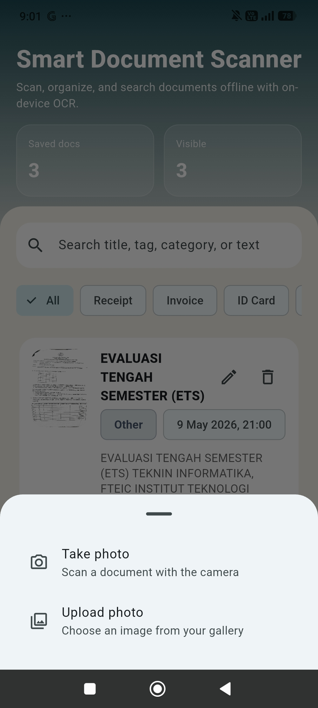
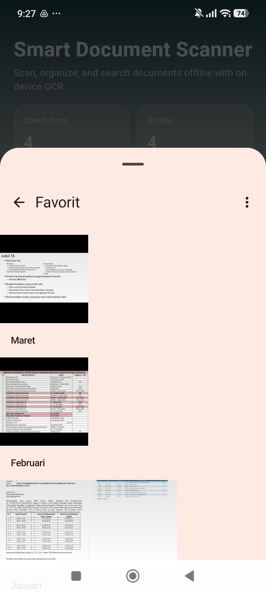
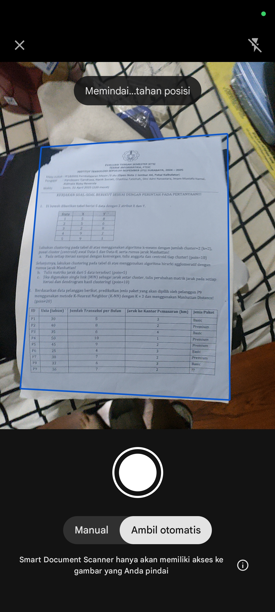
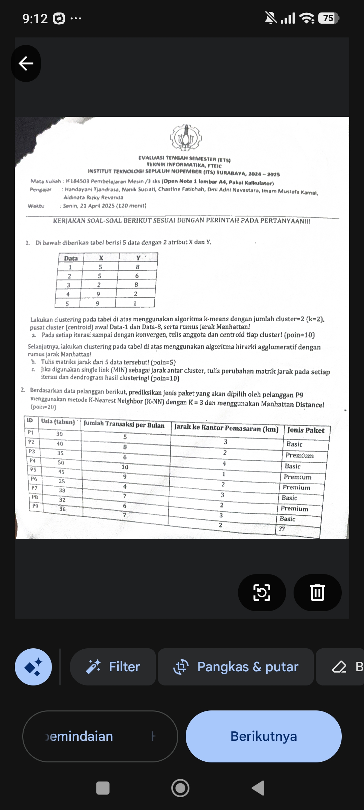
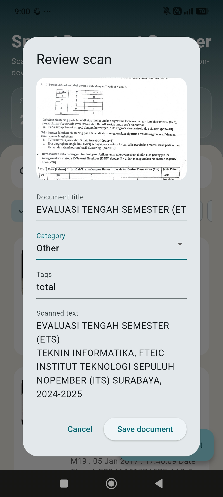
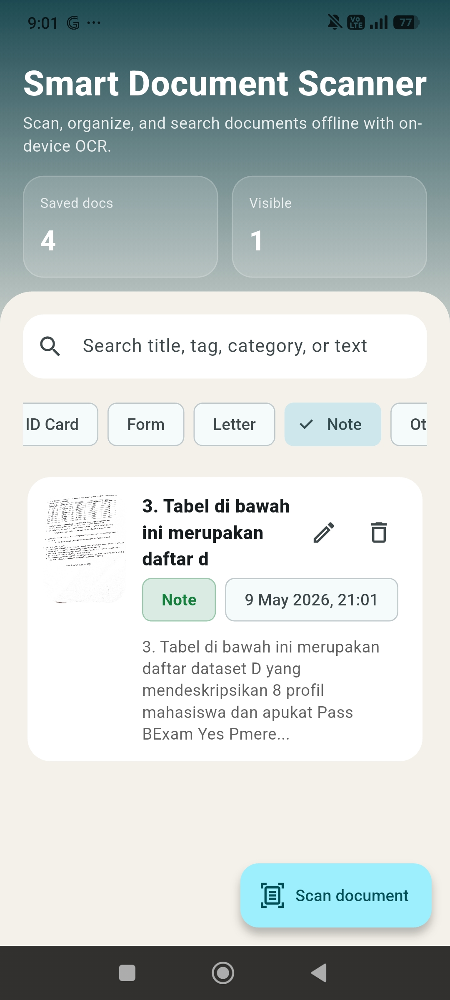

# Smart Document Scanner

A simple offline-first Flutter app that lets the user scan or upload documents,
run on-device OCR, auto-suggest a document category, and organize saved scans by
searchable tags and metadata.

## Features

- Take a photo using `google_document_scanner` or upload an image of a document.
- Extract text locally with `google_mlkit_text_recognition`.
- Auto-suggest document type, title, and tags based on keywords (heuristic approach instead of NLP).
- Review and edit metadata before saving.
- Search and filter saved documents by category and text.
- View scan details, extracted text, and the saved document image.

## Run

```bash
flutter pub get
flutter run -d <android-device-id>
```

## Tests

```bash
flutter test --coverage
```
## Screenshots








## Limitations
The app's OCR performance relies on Google's ML Kit Text Recognition, which does not always detect the correct character and sometimes mispell some words, especially if the image quality is bad. To mitigate this, the app allow the user to edit the text recognition output before saving.